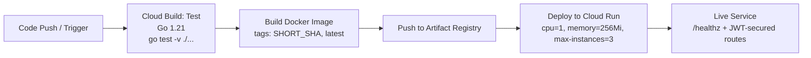

# Web Blog Backend API (Cloud-Native on GCP)

[](https://go.dev/)
[](https://cloud.google.com/build)
[](https://cloud.google.com/run)
[](https://cloud.google.com/artifact-registry)

Production-oriented backend service for a Web Blog platform, built in Go with layered architecture and deployed through a fully GCP-native delivery pipeline.

---

## 1) Project Overview

This API powers a blog platform with:

- User authentication (`/signup`, `/login`) using JWT
- Blog CRUD endpoints (`/`, `/:blogId`, `/post`, `/update`, `/:blogId` delete)
- Role-protected write operations via JWT claim validation
- Health check endpoint (`/healthz`) for runtime probes

The project is designed to demonstrate both backend engineering and cloud delivery maturity for portfolio use.

---

## 2) Tech Stack

> Note: The current implementation uses **Fiber** (not Gin) in this repository.

| Layer | Technology |
|---|---|
| Language | Go 1.21 |
| HTTP Framework | Fiber v2 |
| Auth | JWT (HS256), bcrypt |
| Database | PostgreSQL + sqlx |
| Container | Docker (multi-stage, distroless runtime) |
| CI/CD | Google Cloud Build |
| Image Registry | Google Artifact Registry (GAR) |
| Runtime | Google Cloud Run |
| Config | Environment variables (`DATABASE_URL`, `JWT_SECRET`, `PORT`) |

---

## 3) System Architecture

The codebase follows a clean, modular layering pattern:

| Folder | Responsibility |
|---|---|
| `modules/*/*Handlers` | HTTP transport layer (request/response mapping) |
| `modules/*/*Usecases` | Business logic / application services |
| `modules/*/*Repositories` | Data access (SQL via `sqlx`) |
| `modules/users`, `modules/blogs` | Domain models + DTOs |
| `modules/middlewares` | JWT auth / authorization middleware |
| `internal/config` | Environment and runtime configuration |
| `internal/jwtclaims` | Strongly typed JWT claims |
| `main.go` | Dependency wiring, middleware chain, routes, graceful shutdown |

**Operational concerns implemented in app runtime:**
- Request ID, logger, CORS, and rate limiting
- DB connection pool tuning (`max open`, `max idle`, `conn max lifetime`)
- Graceful shutdown handling (`SIGINT`, `SIGTERM`)

---

## 4) CI/CD Pipeline (Cloud Build Highlight)

The delivery flow is defined in `cloudbuild.yaml` with four stages:

1. **Test**: `go mod download` + `go test -v ./...`
2. **Build**: Docker image build from `Dockerfile` with tags:
   - `${SHORT_SHA}` (immutable release reference)
   - `latest` (moving tag)
3. **Push**: Push both tags to Artifact Registry
4. **Deploy**: `gcloud run deploy` to Cloud Run

### Release & Resource Strategy

| Area | Implementation |
|---|---|
| Versioning | `SHORT_SHA` image tag for traceability/rollback confidence |
| Runtime Limits | `--memory=256Mi`, `--cpu=1`, `--max-instances=3` |
| Exposure | `--allow-unauthenticated` for public API scenario |
| Runtime Env | `--set-env-vars=DATABASE_URL=...,JWT_SECRET=...` |

### Security Posture

- Service-to-service auth should use **dedicated Service Accounts** with least privilege.
- CI/CD role model should include only required permissions (build, push, deploy, logs).
- For enterprise usage, move sensitive substitutions to **Secret Manager** integration.

---

## 5) Cloud-Native & IaC Perspective

Using `cloudbuild.yaml` as declarative pipeline config gives this project a production-ready foundation:

- **Pipeline as Code**: auditable, versioned, reproducible delivery process
- **Environment Consistency**: same build/deploy logic across contributors and stages
- **Immutable Deployments**: deploy by image digest/tag, not mutable binaries
- **Managed Runtime**: Cloud Run handles scaling, service lifecycle, and platform operations
- **Operational Readiness**: health endpoint + graceful shutdown support cloud autoscaling behavior

---

## 6) Setup & Deployment Guide (GCP)

### Prerequisites

- A GCP project with billing enabled
- APIs enabled:
  - Cloud Build API
  - Cloud Run Admin API
  - Artifact Registry API

### Create Artifact Registry

1. Create a Docker repository in your region (e.g. `asia-southeast1`)
2. Set `_GAR_REPO` in `cloudbuild.yaml` (or override in trigger)

### Create Cloud Run Service Target

Set `_SERVICE_NAME` and `_REGION` substitutions to match your target deployment.

### Configure Cloud Build Trigger

1. Go to **Cloud Build → Triggers**
2. Connect repository and select branch (e.g. `main`)
3. Choose config type: **Cloud Build configuration file**
4. Set path to `cloudbuild.yaml`
5. Add/override substitutions as needed:
   - `_REGION`
   - `_GAR_REPO`
   - `_SERVICE_NAME`
   - `_DATABASE_URL`
   - `_JWT_SECRET`

### Required IAM Roles

Grant roles to the Cloud Build execution identity (or custom deploy service account):

| Role | Purpose |
|---|---|
| `roles/artifactregistry.writer` | Push images to Artifact Registry |
| `roles/run.admin` | Deploy/update Cloud Run service |
| `roles/iam.serviceAccountUser` | Use runtime service account during deploy |
| `roles/logging.logWriter` | Write build/runtime logs |

> Principle: apply **least privilege** and scope roles narrowly to project/resources.

---

## 7) CI/CD Flow Diagram



---

## 8) API Snapshot

| Method | Endpoint | Description | Auth |
|---|---|---|---|
| `POST` | `/signup` | Register user | Public |
| `POST` | `/login` | Login and get JWT | Public |
| `GET` | `/` | List blogs (paginated) | Public |
| `GET` | `/:blogId` | Get blog by id | Public |
| `POST` | `/post` | Create blog | JWT + Admin |
| `PUT` | `/update` | Update blog | JWT + Admin |
| `DELETE` | `/:blogId` | Delete blog | JWT + Admin |
| `GET` | `/healthz` | Health check (DB ping) | Public |

---

## 9) Local Run (Quick Start)

1. Copy `.env.example` to `.env`
2. Set:
   - `DATABASE_URL`
   - `JWT_SECRET`
   - `PORT` (optional; default `8080`)
3. Run:

```bash
go mod download
go run .
```

Or with Docker:

```bash
docker build -t goblogclean:local .
docker run --rm -p 8080:8080 --env-file .env goblogclean:local
```

---

## Thai Summary (สรุปภาษาไทย)

README นี้สรุปโปรเจกต์ Web Blog Backend ในเชิงวิศวกรรมจริง โดยเชื่อมฝั่งโค้ด (Go + layered architecture + JWT + health check + graceful shutdown) กับฝั่งโครงสร้างพื้นฐานบน GCP (Cloud Build → Artifact Registry → Cloud Run) แบบครบวงจร พร้อมอธิบาย flow CI/CD, การ tag ด้วย `SHORT_SHA`, การจำกัด resource ของ Cloud Run, แนวคิด least privilege สำหรับ IAM, และขั้นตอนตั้ง Trigger เพื่อใช้งานในระดับ Production/Portfolio ได้ทันที.
